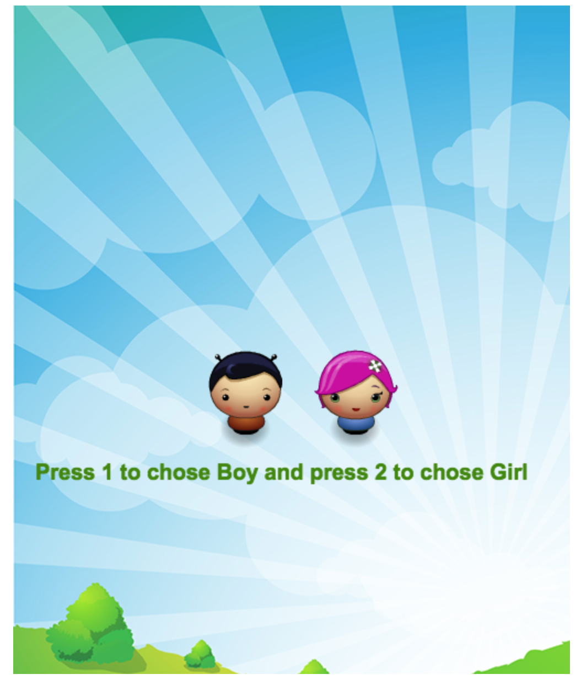
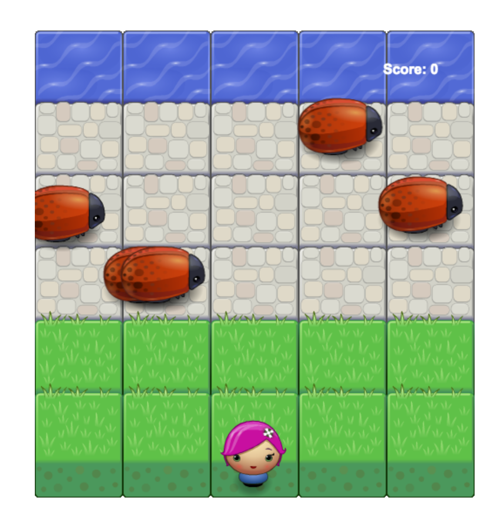

# Classic Arcade Game
#### you must try to cross your player to other side without touch any bugs on your way
## How to install game

1. go to (https://github.com/HaifaM90/frontend-nanodegree-arcade-game) then click on (clone or download)
* Download Zip
* unzip the folder
* double click on (index.html)

## How to work

1. in first screen as below you need to
* click (1) to chose boy character
* click (2) to chose girl character

then the game will start auto.

2. to moves on game area use arrows keyboard

## Good Luck and have fun
